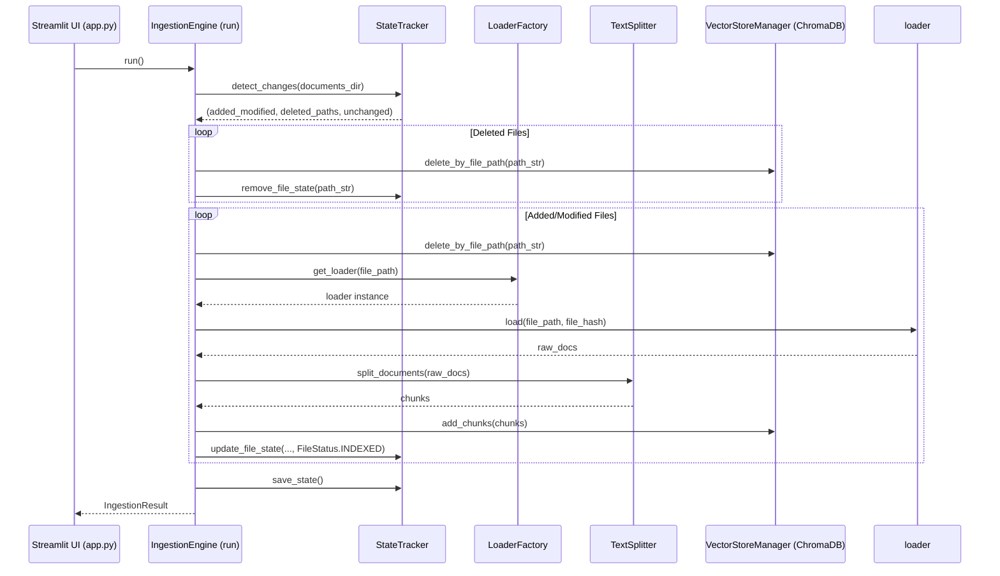

# Ingestion Engine Guidelines (`ingestion.py`)

## Folder & File Context

The [`src/core/ingestion/`](file:///Users/sarthakjain/Desktop/Personal/business_analyst_rag/src/core/ingestion) folder houses [`ingestion.py`](file:///Users/sarthakjain/Desktop/Personal/business_analyst_rag/src/core/ingestion/ingestion.py), which serves as the **unified orchestrator** for the document ingestion and indexing pipeline.

It connects four key subsystems into an atomic, incremental ingestion workflow:
1. Change Detection & State Tracking: [`StateTracker`](file:///Users/sarthakjain/Desktop/Personal/business_analyst_rag/src/core/state_tracker/state_tracker.py#L32-L148)
2. Document Parsing: [`LoaderFactory`](file:///Users/sarthakjain/Desktop/Personal/business_analyst_rag/src/loaders/factory/factory.py#L16-L41)
3. Text Chunking: [`TextSplitter`](file:///Users/sarthakjain/Desktop/Personal/business_analyst_rag/src/core/text_splitter/text_splitter.py#L9-L44)
4. Vector Database Storage: [`VectorStoreManager`](file:///Users/sarthakjain/Desktop/Personal/business_analyst_rag/src/vector_store/store.py#L16-L172)

---

## Detailed Code Explanation & Method Breakdown

### 1. Ingestion Output Dataclass ([`IngestionResult`](file:///Users/sarthakjain/Desktop/Personal/business_analyst_rag/src/core/ingestion/ingestion.py#L15-L21))

```python
@dataclass
class IngestionResult:
    added_or_modified_count: int
    deleted_count: int
    processed_chunks: int
    errors: List[str]
    documents_status: Dict[str, Any]
```

- **Purpose**: Structure passed to UI components ([`app.py`](file:///Users/sarthakjain/Desktop/Personal/business_analyst_rag/app.py)) summarizing execution metrics after an ingestion run.

---

### 2. Orchestrator Class ([`IngestionEngine`](file:///Users/sarthakjain/Desktop/Personal/business_analyst_rag/src/core/ingestion/ingestion.py#L24-L100))

#### Constructor: [`__init__`](file:///Users/sarthakjain/Desktop/Personal/business_analyst_rag/src/core/ingestion/ingestion.py#L27-L37)
- **Logic**: Instantiates default implementations for [`StateTracker`](file:///Users/sarthakjain/Desktop/Personal/business_analyst_rag/src/core/state_tracker/state_tracker.py#L32-L148), [`VectorStoreManager`](file:///Users/sarthakjain/Desktop/Personal/business_analyst_rag/src/vector_store/store.py#L16-L172), and [`TextSplitter`](file:///Users/sarthakjain/Desktop/Personal/business_analyst_rag/src/core/text_splitter/text_splitter.py#L9-L44) if not explicitly injected. Uses lazy imports where needed to break circular dependencies.

#### Main Execution Pipeline: [`run()`](file:///Users/sarthakjain/Desktop/Personal/business_analyst_rag/src/core/ingestion/ingestion.py#L39-L100)
- **Phase 1: Incremental Change Detection** ([L42-L44](file:///Users/sarthakjain/Desktop/Personal/business_analyst_rag/src/core/ingestion/ingestion.py#L42-L44)):
  Invokes [`StateTracker.detect_changes(...)`](file:///Users/sarthakjain/Desktop/Personal/business_analyst_rag/src/core/state_tracker/state_tracker.py#L79-L111) to inspect `data/documents/` and obtain `(added_modified, deleted_paths, unchanged)`.
- **Phase 2: Deleted Vector Eviction** ([L49-L52](file:///Users/sarthakjain/Desktop/Personal/business_analyst_rag/src/core/ingestion/ingestion.py#L49-L52)):
  Iterates over `deleted_paths`, calling [`VectorStoreManager.delete_by_file_path(...)`](file:///Users/sarthakjain/Desktop/Personal/business_analyst_rag/src/vector_store/store.py#L57-L69) and [`StateTracker.remove_file_state(...)`](file:///Users/sarthakjain/Desktop/Personal/business_analyst_rag/src/core/state_tracker/state_tracker.py#L132-L134).
- **Phase 3: Added & Modified Processing** ([L54-L85](file:///Users/sarthakjain/Desktop/Personal/business_analyst_rag/src/core/ingestion/ingestion.py#L54-L85)):
  - Validates file format via [`LoaderFactory.is_supported(...)`](file:///Users/sarthakjain/Desktop/Personal/business_analyst_rag/src/loaders/factory/factory.py#L39-L41).
  - Evicts stale vectors for modified files using [`delete_by_file_path`](file:///Users/sarthakjain/Desktop/Personal/business_analyst_rag/src/vector_store/store.py#L57-L69).
  - Fetches loader instance from [`LoaderFactory.get_loader(...)`](file:///Users/sarthakjain/Desktop/Personal/business_analyst_rag/src/loaders/factory/factory.py#L29-L37) and loads raw document pages.
  - Splits text into chunked `Document` objects with [`TextSplitter.split_documents(...)`](file:///Users/sarthakjain/Desktop/Personal/business_analyst_rag/src/core/text_splitter/text_splitter.py#L23-L44).
  - Embeds chunks into ChromaDB with [`VectorStoreManager.add_chunks(...)`](file:///Users/sarthakjain/Desktop/Personal/business_analyst_rag/src/vector_store/store.py#L53-L55) and updates [`StateTracker`](file:///Users/sarthakjain/Desktop/Personal/business_analyst_rag/src/core/state_tracker/state_tracker.py#L113-L130).
- **Phase 4: Persistence** ([L87](file:///Users/sarthakjain/Desktop/Personal/business_analyst_rag/src/core/ingestion/ingestion.py#L87)):
  Saves updated state JSON to disk via [`StateTracker.save_state()`](file:///Users/sarthakjain/Desktop/Personal/business_analyst_rag/src/core/state_tracker/state_tracker.py#L69-L77) and returns [`IngestionResult`](file:///Users/sarthakjain/Desktop/Personal/business_analyst_rag/src/core/ingestion/ingestion.py#L15-L21).

---

## Workflow Diagram


