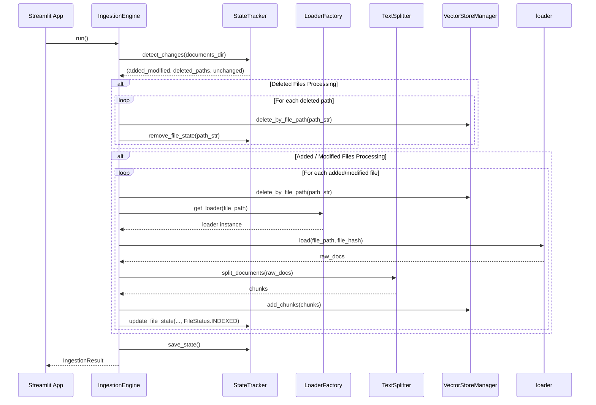

# Ingestion Engine Guidelines (`ingestion.py`)

## Overview

The [`ingestion.py`](ingestion.py) module serves as the **unified orchestrator** for the document ingestion pipeline. It coordinates document loading, state management, text chunking, and vector database synchronization into an atomic, incremental workflow.

It connects:

- [`StateTracker`](../state_tracker/guidelines.md) (Incremental change detection & SHA-256 state)
- [`LoaderFactory`](../../loaders/factory/guidelines.md) (Multi-format document loaders)
- [`TextSplitter`](../text_splitter/guidelines.md) (Recursive text chunking)
- `VectorStoreManager` (ChromaDB vector embedding & deletion)

---

## Code Structure & Part-by-Part Explanation

### 1. Ingestion Output Container (`IngestionResult`)

```python
@dataclass
class IngestionResult:
    added_or_modified_count: int
    deleted_count: int
    processed_chunks: int
    errors: List[str]
    documents_status: Dict[str, Any]
```

- **Logic**: A structured summary object returned after executing an ingestion cycle:
  - `added_or_modified_count`: Count of new or updated files detected on disk.
  - `deleted_count`: Count of removed files evicted from vector storage.
  - `processed_chunks`: Total count of new vector embeddings added to ChromaDB.
  - `errors`: List of descriptive failure messages encountered during document processing.
  - `documents_status`: Complete dictionary snapshot of tracked document states for UI tables.

---

### 2. Orchestrator Engine (`IngestionEngine`)

#### Constructor (`__init__`)

```python
def __init__(
    self,
    documents_dir: Path = settings.DOCUMENTS_DIR,
    state_tracker: Optional[StateTracker] = None,
    vector_store: Optional["VectorStoreManager"] = None,
    text_splitter: Optional[TextSplitter] = None,
):
    from src.vector_store.store import VectorStoreManager

    self.documents_dir = documents_dir
    self.state_tracker = state_tracker or StateTracker()
    self.vector_store = vector_store or VectorStoreManager()
    self.text_splitter = text_splitter or TextSplitter()
```

- **Logic**: Initializes pipeline dependencies with default implementations if omitted. Uses local import for `VectorStoreManager` to break potential circular import dependencies.

---

#### Execution Pipeline (`run`)

```python
def run(self) -> IngestionResult:
```

- **Phase 1: Incremental Change Detection**

  ```python
  added_modified, deleted_paths, unchanged = self.state_tracker.detect_changes(
      self.documents_dir
  )
  ```

  Compares disk contents in `data/documents/` against recorded SHA-256 hashes in `ingestion_state.json`. Unchanged files are bypassed automatically.

- **Phase 2: Vector & State Eviction for Deleted Files**

  ```python
  for path_str in deleted_paths:
      logger.info(f"Evicting deleted file vectors: {path_str}")
      self.vector_store.delete_by_file_path(path_str)
      self.state_tracker.remove_file_state(path_str)
  ```

  Deletes all existing vector embeddings matching `path_str` from ChromaDB and purges the file record from `StateTracker`.

- **Phase 3: Processing Added or Modified Files**

  ```python
  for file_path in added_modified:
      path_str = str(file_path.resolve())
      file_hash = self.state_tracker.calculate_file_hash(file_path)

      if not LoaderFactory.is_supported(file_path):
          logger.warning(f"Skipping unsupported file format: {file_path.name}")
          continue

      try:
          # Delete stale vectors if file was modified
          self.vector_store.delete_by_file_path(path_str)

          # Load raw documents
          loader = LoaderFactory.get_loader(file_path)
          raw_docs = loader.load(file_path, file_hash)

          # Chunk text
          chunks = self.text_splitter.split_documents(raw_docs)

          # Upsert chunks into Vector Store & update state
          if chunks:
              added_count = self.vector_store.add_chunks(chunks)
              total_chunks_added += added_count
              self.state_tracker.update_file_state(
                  file_path, file_hash, len(chunks), status=FileStatus.INDEXED
              )
          else:
              self.state_tracker.update_file_state(
                  file_path, file_hash, 0, status=FileStatus.EMPTY
              )

      except Exception as e:
          err_msg = f"Failed to ingest file {file_path.name}: {str(e)}"
          logger.error(err_msg)
          errors.append(err_msg)
          self.state_tracker.update_file_state(
              file_path, file_hash, 0, status=f"{FileStatus.FAILED}: {str(e)}"
          )
  ```

- **Phase 4: Persistence & Summary Return**
  ```python
  self.state_tracker.save_state()
  return IngestionResult(...)
  ```
  Saves the updated state to `data/metadata/ingestion_state.json` and logs pipeline metrics.

---

## Complete Ingestion Workflow Diagram



---

## Best Practices & Guidelines for Developers

1. **Atomic Ingestion Cycles**: Always call `save_state()` at the conclusion of `run()` so file state on disk matches vector store contents.
2. **Pre-Eviction Before Re-indexing**: When a file is modified, delete its existing vectors (`delete_by_file_path`) _before_ adding new chunks to prevent orphan or stale vectors in ChromaDB.
3. **Resilient Exception Catching**: Catch per-file exceptions during parsing/embedding so a single corrupted file does not crash the entire ingestion loop for other documents.
