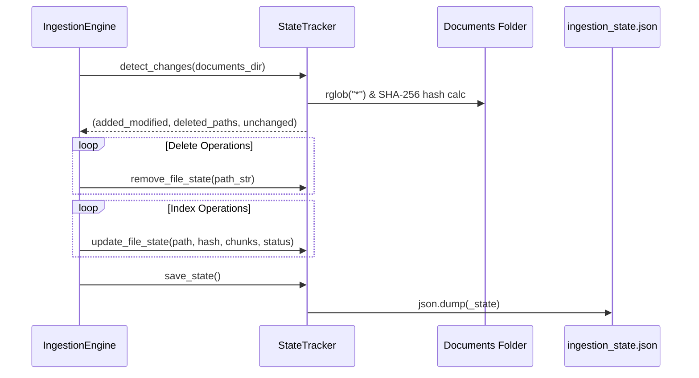

# State Tracker Guidelines (`state_tracker.py`)

## Folder & File Context

The [`src/core/state_tracker/`](file:///Users/sarthakjain/Desktop/Personal/business_analyst_rag/src/core/state_tracker) directory contains [`state_tracker.py`](file:///Users/sarthakjain/Desktop/Personal/business_analyst_rag/src/core/state_tracker/state_tracker.py), which handles **hash-based incremental file tracking**.

It records metadata and SHA-256 checksums of documents in `data/documents/` and persists this state to `data/metadata/ingestion_state.json`. By detecting which files are new, modified, deleted, or unchanged, it guarantees that vector database embedding operations are performed only when file contents actually change.

---

## Detailed Code Explanation & Class Breakdown

### 1. File Status Enum ([`FileStatus`](file:///Users/sarthakjain/Desktop/Personal/business_analyst_rag/src/core/state_tracker/state_tracker.py#L14-L18))

```python
class FileStatus(str, Enum):
    INDEXED = "indexed"
    FAILED = "failed"
    PENDING = "pending"
    EMPTY = "empty"
```

- **Logic**: String-backed `Enum` inheriting from `str` and `Enum`. Allows string serialization for JSON export and UI tables without string typo vulnerabilities.

---

### 2. State Data Container ([`FileState`](file:///Users/sarthakjain/Desktop/Personal/business_analyst_rag/src/core/state_tracker/state_tracker.py#L21-L30))

```python
@dataclass
class FileState:
    file_path: str
    file_name: str
    file_hash: str
    file_size_bytes: int
    last_modified: float
    chunk_count: int = 0
    status: FileStatus | str = FileStatus.INDEXED
```

- **Logic**: Dataclass representing the metadata record for each document stored in `StateTracker._state` dictionary.

---

### 3. Core State Manager ([`StateTracker`](file:///Users/sarthakjain/Desktop/Personal/business_analyst_rag/src/core/state_tracker/state_tracker.py#L32-L148))

#### Methods Breakdown:

- [`__init__(metadata_dir)`](file:///Users/sarthakjain/Desktop/Personal/business_analyst_rag/src/core/state_tracker/state_tracker.py#L35-L38): Sets path to `ingestion_state.json` and loads existing file records.
- [`calculate_file_hash(file_path) -> str`](file:///Users/sarthakjain/Desktop/Personal/business_analyst_rag/src/core/state_tracker/state_tracker.py#L40-L46): Reads files in 64KB (65,536 bytes) binary chunks to compute SHA-256 digests without high RAM overhead.
- [`load_state()`](file:///Users/sarthakjain/Desktop/Personal/business_analyst_rag/src/core/state_tracker/state_tracker.py#L48-L67): Parses JSON from `ingestion_state.json` into [`FileState`](file:///Users/sarthakjain/Desktop/Personal/business_analyst_rag/src/core/state_tracker/state_tracker.py#L21-L30) objects.
- [`save_state()`](file:///Users/sarthakjain/Desktop/Personal/business_analyst_rag/src/core/state_tracker/state_tracker.py#L69-L77): Serializes `_state` map to formatted JSON (`indent=2`) using `dataclasses.asdict`.
- [`detect_changes(documents_dir) -> Tuple[...]`](file:///Users/sarthakjain/Desktop/Personal/business_analyst_rag/src/core/state_tracker/state_tracker.py#L79-L111):
  1. Recursively scans `documents_dir` using `rglob("*")`.
  2. Computes SHA-256 for disk files and compares against stored hash.
  3. Returns `(added_or_modified: List[Path], deleted_paths: List[str], unchanged: List[str])`.
- [`update_file_state(...)`](file:///Users/sarthakjain/Desktop/Personal/business_analyst_rag/src/core/state_tracker/state_tracker.py#L113-L130): Updates metadata record when a file is processed.
- [`remove_file_state(path_str)`](file:///Users/sarthakjain/Desktop/Personal/business_analyst_rag/src/core/state_tracker/state_tracker.py#L132-L134): Removes entry when a file is deleted from disk.
- [`clear_all()`](file:///Users/sarthakjain/Desktop/Personal/business_analyst_rag/src/core/state_tracker/state_tracker.py#L139-L148): Unlinks `ingestion_state.json` and resets internal dictionary.

---

## State Tracking Sequence


