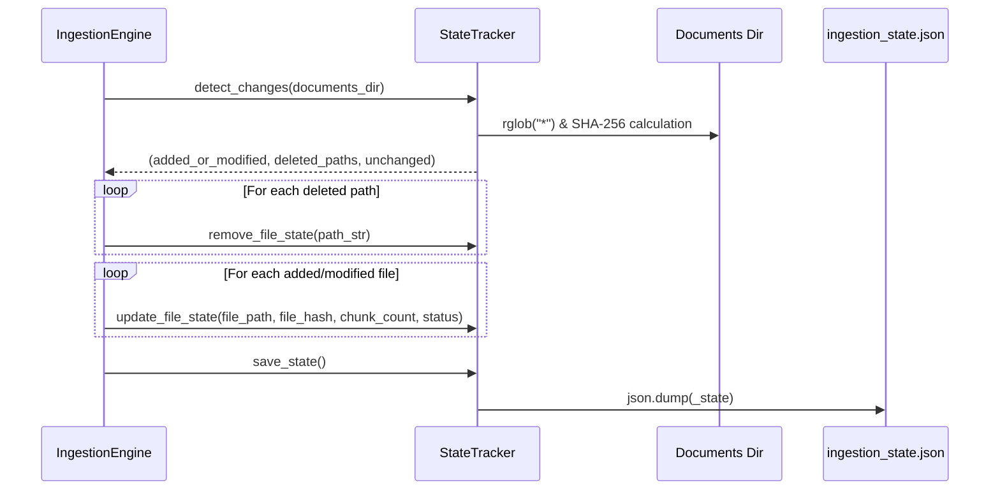

# State Tracker Guidelines (`state_tracker.py`)

## Overview

The [`state_tracker.py`](file:///Users/sarthakjain/Desktop/Personal/business_analyst_rag/src/core/state_tracker.py) module manages **hash-based incremental ingestion state** for the Business Analyst RAG pipeline. It tracks metadata and SHA-256 checksums of documents processed in `data/documents/` and persists this state to a local JSON file (`data/metadata/ingestion_state.json`).

By detecting which files are **new**, **modified**, **deleted**, or **unchanged**, it ensures the vector store is synchronized efficiently without redundant embedding calculations.

---

## Code Structure & Part-by-Part Explanation

### 1. Module Imports & Setup

```python
import hashlib
import json
from dataclasses import asdict, dataclass
from enum import Enum
from pathlib import Path
from typing import Dict, List, Tuple

from src.config import settings
from src.utils.logger import get_logger

logger = get_logger("state_tracker")
```

- **`hashlib`**: Computes SHA-256 cryptographic hashes for document files.
- **`json`**: Serializes and deserializes ingestion state to/from disk (`ingestion_state.json`).
- **`dataclasses`**: Provides lightweight data structures (`asdict`, `@dataclass`) for document metadata.
- **`enum.Enum`**: Defines string-backed enumeration values for document indexing states.
- **`pathlib.Path`**: Handles cross-platform filesystem paths safely.
- **`settings`**: Provides default directory locations (`settings.METADATA_DIR`, `settings.DOCUMENTS_DIR`).

---

### 2. File Status Enumeration (`FileStatus`)

```python
class FileStatus(str, Enum):
    INDEXED = "indexed"
    FAILED = "failed"
    PENDING = "pending"
    EMPTY = "empty"
```

- **Logic**: Inherits from both `str` and `Enum`. This allows Enum members to behave natively as strings (for JSON serialization and UI dataframes) while preventing hardcoded string typos throughout the codebase.
- **Values**:
  - `INDEXED`: File was successfully loaded, chunked, and embedded into the vector store.
  - `FAILED`: An error occurred during file parsing, chunking, or embedding.
  - `PENDING`: File is queued for ingestion.
  - `EMPTY`: File was loaded but yielded 0 text chunks (e.g., blank document).

---

### 3. File State Data Container (`FileState`)

```python
@dataclass
class FileState:
    file_path: str
    file_name: str
    file_hash: str
    file_size_bytes: int
    last_modified: float
    chunk_count: int = 0
    status: FileStatus | str = FileStatus.INDEXED
```

- **Logic**: Stores essential metadata for each ingested document key in `_state` dictionary:
  - `file_path`: Absolute resolved file path (`str`) used as the primary key.
  - `file_name`: Basename of the file (e.g. `financial_report.pdf`).
  - `file_hash`: SHA-256 hash string of the file content.
  - `file_size_bytes`: OS stat file size in bytes.
  - `last_modified`: OS stat last modification timestamp (`st_mtime`).
  - `chunk_count`: Total number of vector chunks stored in ChromaDB for this document.
  - `status`: Indexing status (`FileStatus` or formatted error string).

---

### 4. Core State Manager (`StateTracker`)

#### Constructor (`__init__`)

```python
def __init__(self, metadata_dir: Path = settings.METADATA_DIR):
    self.state_file = metadata_dir / "ingestion_state.json"
    self._state: Dict[str, FileState] = {}
    self.load_state()
```

- **Logic**: Constructs the path to `ingestion_state.json` and immediately loads existing state records into the private `self._state` dictionary (`Dict[file_path_str, FileState]`).

---

#### SHA-256 Hash Computation (`calculate_file_hash`)

```python
def calculate_file_hash(self, file_path: Path) -> str:
    """Calculates SHA-256 hash of a file on disk."""
    sha256 = hashlib.sha256()
    with open(file_path, "rb") as f:
        while chunk := f.read(65536):
            sha256.update(chunk)
    return sha256.hexdigest()
```

- **Logic**: Reads the file in binary chunks of 64 KB (65,536 bytes) rather than loading the entire file into memory at once. This ensures minimal RAM usage even when processing large files (PDFs, multi-MB Excel sheets). Returns the hex digest.

---

#### Loading State from Disk (`load_state`)

```python
def load_state(self) -> None:
    """Loads recorded file ingestion state from JSON."""
    if self.state_file.exists():
        try:
            with open(self.state_file, "r", encoding="utf-8") as f:
                raw_data = json.load(f)
                self._state = {}
                for path, data in raw_data.items():
                    if "status" in data and isinstance(data["status"], str):
                        try:
                            data["status"] = FileStatus(data["status"])
                        except ValueError:
                            pass
                    self._state[path] = FileState(**data)
            logger.info(f"Loaded state tracker with {len(self._state)} recorded files.")
        except Exception as e:
            logger.error(f"Failed to read state tracker file {self.state_file}: {e}")
            self._state = {}
    else:
        self._state = {}
```

- **Logic**:
  1. Checks if `ingestion_state.json` exists on disk.
  2. Parses JSON dictionary into `FileState` objects.
  3. Converts string status fields back into `FileStatus` Enum instances when valid.
  4. If reading fails or file is corrupt, logs an error and resets `self._state` to an empty dictionary to prevent system failure.

---

#### Saving State to Disk (`save_state`)

```python
def save_state(self) -> None:
    """Saves current state to JSON."""
    try:
        self.state_file.parent.mkdir(parents=True, exist_ok=True)
        with open(self.state_file, "w", encoding="utf-8") as f:
            json.dump({path: asdict(state) for path, state in self._state.items()}, f, indent=2)
        logger.info("Saved ingestion state tracker.")
    except Exception as e:
        logger.error(f"Failed to save state tracker: {e}")
```

- **Logic**: Ensures parent directories (`data/metadata/`) exist, converts all `FileState` dataclass objects into dictionaries using `asdict()`, and writes formatted JSON (`indent=2`) to disk.

---

#### Change Detection Algorithm (`detect_changes`)

```python
def detect_changes(
    self, documents_dir: Path = settings.DOCUMENTS_DIR
) -> Tuple[List[Path], List[str], List[str]]:
```

- **Logic**:
  1. **Disk Scan**: Uses `documents_dir.rglob("*")` to find all files recursively, ignoring hidden files (starting with `.`).
  2. **Hash Comparison**:
     - Computes SHA-256 hash for each disk file.
     - Compares hash against recorded hash in `self._state`.
     - If not recorded or hash differs $\Rightarrow$ appended to `added_or_modified`.
     - If hash matches $\Rightarrow$ appended to `unchanged`.
  3. **Deletion Detection**:
     - Computes set difference: `recorded_paths - current_paths`.
     - Any path in `self._state` no longer on disk is returned as `deleted_paths`.
  4. **Return**: Returns `(added_or_modified: List[Path], deleted_paths: List[str], unchanged: List[str])`.

---

#### Updating & Removing File States

```python
def update_file_state(
    self,
    file_path: Path,
    file_hash: str,
    chunk_count: int,
    status: FileStatus | str = FileStatus.INDEXED,
) -> None:
    path_str = str(file_path.resolve())
    stat = file_path.stat()
    self._state[path_str] = FileState(
        file_path=path_str,
        file_name=file_path.name,
        file_hash=file_hash,
        file_size_bytes=stat.st_size,
        last_modified=stat.st_mtime,
        chunk_count=chunk_count,
        status=status,
    )

def remove_file_state(self, path_str: str) -> None:
    if path_str in self._state:
        del self._state[path_str]
```

- **Logic**:
  - `update_file_state`: Called after successful file processing to save the updated size, modification time, chunk count, and status into memory.
  - `remove_file_state`: Called when a file has been deleted from disk so its vectors can be evicted and state entry removed.

---

## State Lifecycle Workflow



---

## Best Practices & Guidelines for Developers

1. **Always Use `FileStatus` Enum**: Avoid hardcoding raw string statuses like `"indexed"` or `"failed"` in code. Import `FileStatus` from `src.core.state_tracker`.
2. **Chunked Reading**: When extending hash functions or file processing, always stream large files in chunks (e.g. 64KB) to avoid memory spikes.
3. **Absolute Path Keys**: State tracking keys MUST be absolute resolved path strings (`str(path.resolve())`) to prevent duplicate keys due to relative path variations.
