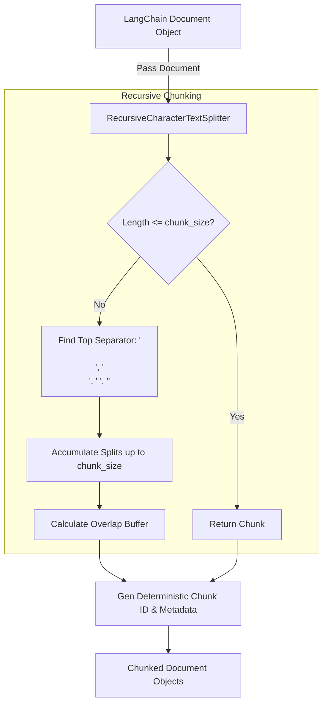

# Text Splitter Guidelines (`text_splitter.py`)

## Overview

The [`text_splitter.py`](text_splitter.py) module provides recursive text chunking capabilities for the Business Analyst RAG pipeline. It converts large [`Document`](../../loaders/base/guidelines.md) objects emitted by loaders into smaller, context-preserving chunked `Document` instances carrying rich metadata (`chunk_id`, `chunk_index`, `total_chunks`) suitable for vector embedding and retrieval.

---

## Code Structure & Part-by-Part Explanation

### 1. Recursive Splitter (`TextSplitter`)

#### Constructor (`__init__`)

```python
def __init__(
    self, chunk_size: int = settings.CHUNK_SIZE, chunk_overlap: int = settings.CHUNK_OVERLAP
):
    self.chunk_size = chunk_size
    self.chunk_overlap = chunk_overlap
    self.splitter = RecursiveCharacterTextSplitter(
        chunk_size=self.chunk_size,
        chunk_overlap=self.chunk_overlap,
        separators=["\n\n", "\n", " ", ""],
    )
```

- **Logic**:
  - `chunk_size`: Maximum character length per chunk (default from `settings.CHUNK_SIZE`).
  - `chunk_overlap`: Character overlap between consecutive chunks to maintain contextual continuity across boundaries (default from `settings.CHUNK_OVERLAP`).
  - `separators`: Hierarchical list of separators:
    1. `"\n\n"` (Paragraph breaks)
    2. `"\n"` (Line breaks)
    3. `" "` (Word boundaries)
    4. `""` (Fallback to character-level split)

---

#### Document Orchestrator (`split_documents`)

```python
def split_documents(self, documents: List[Document]) -> List[Document]:
```

- **Logic**:
  1. Iterates over input LangChain `Document` objects.
  2. Passes `doc` to `self.splitter.split_documents([doc])`.
  3. Generates deterministic `chunk_id` using format:
     `{file_hash[:8]}_{clean_sec}_chunk_{idx}`
  4. Merges `doc.metadata` with `chunk_id`, `chunk_index`, and `total_chunks`.
  5. Returns `List[Document]`.

---

## Chunking Pipeline Diagram



---

## Best Practices & Guidelines for Developers

1. **Deterministic IDs**: Chunk IDs include a file hash prefix and section indicator to prevent ChromaDB ID collisions.
2. **Metadata Integrity**: Always retain parent metadata (`file_name`, `page_or_section`, `source_file`, `file_hash`) so vector search results cite original sources accurately.
3. **Separator Priority**: Paragraph breaks (`\n\n`) take precedence to preserve semantic cohesion in text and markdown tables.
