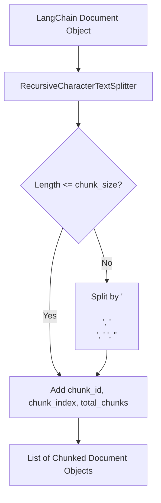

# Text Splitter Guidelines (`text_splitter.py`)

## Folder & File Context

The [`src/core/text_splitter/`](file:///Users/sarthakjain/Desktop/Personal/business_analyst_rag/src/core/text_splitter) directory contains [`text_splitter.py`](file:///Users/sarthakjain/Desktop/Personal/business_analyst_rag/src/core/text_splitter/text_splitter.py), which handles recursive document chunking.

It converts raw [`Document`](file:///Users/sarthakjain/Desktop/Personal/business_analyst_rag/src/loaders/base/base.py) objects emitted by file loaders into smaller, context-preserving text chunks with unique metadata tags suitable for vector embedding generation and retrieval.

---

## Detailed Code Explanation & Class Breakdown

### Recursive Splitter Wrapper ([`TextSplitter`](file:///Users/sarthakjain/Desktop/Personal/business_analyst_rag/src/core/text_splitter/text_splitter.py#L9-L44))

#### Constructor: [`__init__`](file:///Users/sarthakjain/Desktop/Personal/business_analyst_rag/src/core/text_splitter/text_splitter.py#L12-L21)
- Configures `RecursiveCharacterTextSplitter` using:
  - `chunk_size`: Default `1000` characters ([`settings.CHUNK_SIZE`](file:///Users/sarthakjain/Desktop/Personal/business_analyst_rag/src/config.py#L29)).
  - `chunk_overlap`: Default `150` characters ([`settings.CHUNK_OVERLAP`](file:///Users/sarthakjain/Desktop/Personal/business_analyst_rag/src/config.py#L30)).
  - `separators`: Priority list `["\n\n", "\n", " ", ""]` to preserve paragraph boundaries and markdown layout.

#### Chunk Orchestrator: [`split_documents(documents: List[Document]) -> List[Document]`](file:///Users/sarthakjain/Desktop/Personal/business_analyst_rag/src/core/text_splitter/text_splitter.py#L23-L44)
- Iterates over each input `Document`.
- Invokes `self.splitter.split_documents([doc])`.
- Computes deterministic chunk ID: `{file_hash[:8]}_{clean_section}_chunk_{idx}` ([L33](file:///Users/sarthakjain/Desktop/Personal/business_analyst_rag/src/core/text_splitter/text_splitter.py#L33)).
- Appends `chunk_id`, `chunk_index`, and `total_chunks` to doc metadata ([L35-L41](file:///Users/sarthakjain/Desktop/Personal/business_analyst_rag/src/core/text_splitter/text_splitter.py#L35-L41)).

---

## Chunking Pipeline Diagram

