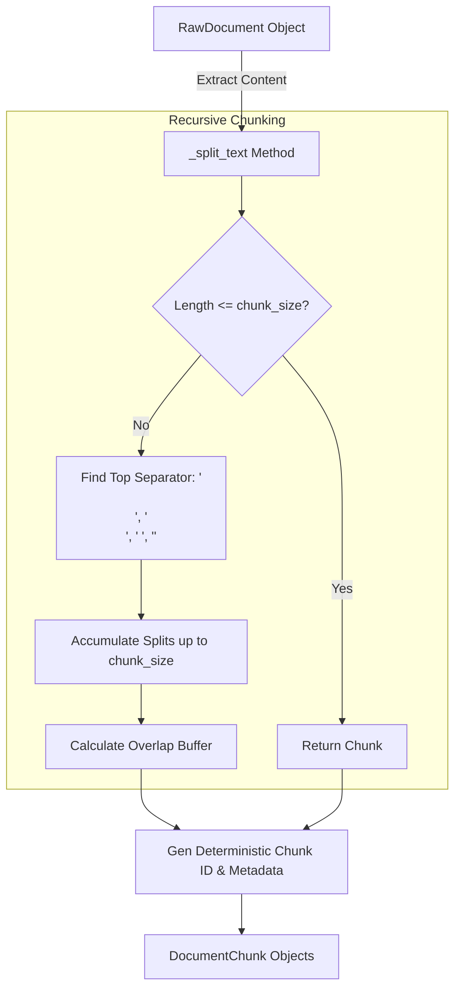

# Text Splitter Guidelines (`text_splitter.py`)

## Overview

The [`text_splitter.py`](text_splitter.py) module provides recursive text chunking capabilities for the Business Analyst RAG pipeline. It converts large [`RawDocument`](../loaders/base/base.py#L6) objects emitted by loaders into smaller, context-preserving [`DocumentChunk`](text_splitter.py#L9) instances suitable for vector embedding and retrieval.

---

## Code Structure & Part-by-Part Explanation

### 1. Data Container (`DocumentChunk`)

```python
@dataclass
class DocumentChunk:
    chunk_id: str
    content: str
    metadata: Dict[str, Any] = field(default_factory=dict)
```

- **Logic**: Dataclass representing an individual chunk prepared for vector storage.
  - `chunk_id`: Deterministic string identifier (e.g. `a1b2c3d4_Sheet1_chunk_0`).
  - `content`: Text slice within `chunk_size` limit.
  - `metadata`: Preserves all parent `RawDocument` metadata (`source_file`, `file_type`, `file_name`, `page_or_section`, `file_hash`) and appends chunk-specific tracking fields (`chunk_id`, `chunk_index`, `total_chunks`).

---

### 2. Recursive Splitter (`TextSplitter`)

#### Constructor (`__init__`)

```python
def __init__(
    self, chunk_size: int = settings.CHUNK_SIZE, chunk_overlap: int = settings.CHUNK_OVERLAP
):
    self.chunk_size = chunk_size
    self.chunk_overlap = chunk_overlap
    self.separators = ["\n\n", "\n", " ", ""]
```

- **Logic**:
  - `chunk_size`: Maximum character length per chunk (default from `settings.CHUNK_SIZE`).
  - `chunk_overlap`: Character overlap between consecutive chunks to maintain contextual continuity across boundaries (default from `settings.CHUNK_OVERLAP`).
  - `separators`: Hierarchical list of separators:
    1. `"\n\n"` (Paragraph breaks)
    2. `"\n"` (Line breaks)
    3. `" "` (Word boundaries)
    4. `""` (Fallback to character-level split)

---

#### Recursive Text Splitting Core (`_split_text`)

```python
def _split_text(self, text: str) -> List[str]:
```

- **Logic & Flow**:
  1. **Base Case**: If `len(text) <= self.chunk_size`, returns `[text]` directly if non-empty.
  2. **Separator Selection**: Finds the first separator present in `text` from `self.separators`.
  3. **Chunk Assembly**: Iterates through splits, building `current_chunk`.
  4. **Overflow & Overlap Handling**:
     - When adding a split would exceed `chunk_size`, joins `current_chunk` using the active separator and pushes to `chunks`.
     - **Overlap Calculation**: Iterates backwards through `current_chunk` items, accumulating up to `chunk_overlap` characters to initialize the next chunk buffer.
  5. **Tail Append**: Joins and appends remaining text after loop termination.

---

#### Document Orchestrator (`split_documents`)

```python
def split_documents(self, documents: List[RawDocument]) -> List[DocumentChunk]:
```

- **Logic**:
  1. Iterates over input `RawDocument` objects.
  2. Passes `doc.content` to `_split_text()`.
  3. Generates deterministic `chunk_id` using format:
     `{file_hash[:8]}_{clean_sec}_chunk_{idx}`
  4. Merges `doc.metadata` with `chunk_id`, `chunk_index`, and `total_chunks`.
  5. Returns `List[DocumentChunk]`.

---

## Chunking Pipeline Diagram



---

## Best Practices & Guidelines for Developers

1. **Deterministic IDs**: Chunk IDs include a file hash prefix and section indicator to prevent ChromaDB ID collisions.
2. **Metadata Integrity**: Always retain parent metadata (`file_name`, `page_or_section`, `source_file`) so vector search results cite original sources accurately.
3. **Separator Priority**: Paragraph breaks (`\n\n`) take precedence to preserve semantic cohesion in text and markdown tables.
