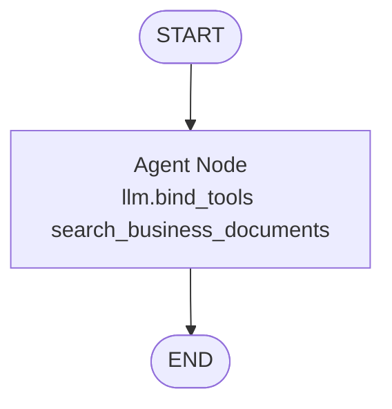

# LLM & LangGraph Tool-Calling RAG Engine - Guidelines

## Overview

The `src/llm/` module interfaces with Google Gemini models (`gemini-3.6-flash`), manages Senior Business Analyst persona system prompts, parses live reasoning thoughts, and orchestrates an autonomous Tool-Calling RAG workflow using **LangGraph** ([`graph.py`](graph.py)) and **RAG Engine** ([`rag_engine.py`](rag_engine.py)).

---

## Code Structure & Method-by-Method Explanation of `graph.py`

### 1. Helper Functions (`extract_text_content` & `strip_thinking_tags`)

```python
def extract_text_content(content: Any) -> str:
def strip_thinking_tags(text: str) -> str:
```

- **`extract_text_content`**: Safely extracts plain text strings from varied LLM response content types (raw string, list of content blocks, dict with `"text"` key, or generic objects), preventing formatting errors when parsing Gemini output.
- **`strip_thinking_tags`**: Strips internal `<thinking>...</thinking>` reasoning blocks from final output string when running non-streaming graph queries.

---

### 2. State Container (`RAGState`)

```python
class RAGState(TypedDict):
    question: str
    chat_history: str
    top_k: int
    similarity_threshold: float
    temperature: float
    messages: List[BaseMessage]
    citations: List[Dict[str, Any]]
    generation: str
```

- **Fields**:
  - `question`: User query string.
  - `chat_history`: Conversation history text.
  - `top_k`: Number of candidate document chunks to retrieve (default: `5`).
  - `similarity_threshold`: Minimum relevance score cutoff (default: `0.3`).
  - `temperature`: Sampling temperature for Gemini generation (default: `0.2`).
  - `messages`: LangChain message trajectory (SystemMessage, HumanMessage, AIMessage, ToolMessage).
  - `citations`: Formatted source cards (file name, section, score, 300-char preview snippet) for UI rendering.
  - `generation`: Final text answer generated by Gemini.

---

### 3. Tool Factory (`create_document_search_tool`)

```python
def create_document_search_tool(
    vector_store: VectorStoreManager,
    top_k: int = 5,
    similarity_threshold: float = 0.3,
    citations_list: Optional[List[Dict[str, Any]]] = None,
):
```

- **`search_business_documents(query: str)`**:
  - Encapsulates vector store hybrid search into a formal LangChain tool.
  - If 0 documents are indexed, returns a message guiding the user to upload documents.
  - Returns retrieved text context blocks formatted with source metadata and similarity scores.

---

### 4. Tool-Calling Agent Builder (`build_rag_graph`)

```python
def build_rag_graph(vector_store: VectorStoreManager, model_name: Optional[str] = None):
```

- Binds `search_business_documents` tool to Gemini using `llm.bind_tools([search_tool])`.
- Instantiates a stateful Tool-Calling Agent graph where the model autonomously determines whether to call `search_business_documents` or answer directly.



---

## Streaming Execution & Thinking Token Parser (`rag_engine.py`)

### `ThinkingStreamParser`

```python
class ThinkingStreamParser:
    def feed(self, chunk: str) -> List[Tuple[str, str]]:
```

- Parses streaming text tokens coming from Gemini.
- Automatically isolates `<thinking>...</thinking>` reasoning blocks into `("thought", token)` events and final response text into `("answer", token)` events.

### Event Types yielded by `query_stream`

1. `("status", text)`: Emits live agent decision status (e.g. `🤖 Agent Thinking`, `🛠️ Tool Invoked`, `📄 Tool Result Received`).
2. `("thought", token)`: Emits model analytical thought tokens for live rendering inside Streamlit status container.
3. `("answer", token)`: Emits final response tokens.

---

## System Prompts (`prompts.py`)

- **`TOOL_CALLING_ANALYST_SYSTEM_PROMPT`**:
  - Instructs Gemini to act as a **Senior Business Analyst & Strategic Advisor**.
  - Directs model to output `<thinking>` reasoning step-by-step.
  - Directs model to call `search_business_documents` when specific company files/reports are queried, and answer directly for general finance concepts, greetings, and math/python formulas.

---

## Best Practices for Developers

1. **Autonomous Tool Routing**: Avoid static prompt classifiers before retrieval; let the LLM autonomously invoke `search_business_documents` tool in a single pass.
2. **Thinking Token Isolation**: Always route LLM stream through `ThinkingStreamParser` so raw `<thinking>` tags do not leak into the user's main answer window.
3. **Citations Extraction**: Populate `citations` whenever the vector search tool is executed, enabling rich source attribution expanders in the UI.

