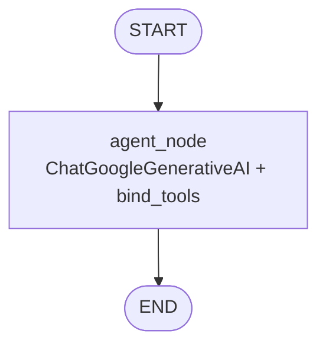
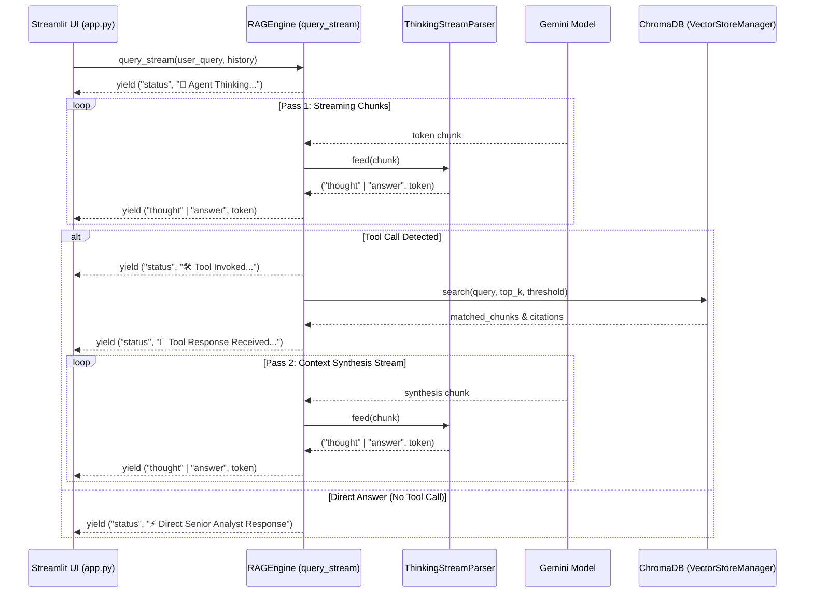

# LLM & LangGraph Tool-Calling RAG Engine - Guidelines

## Folder & Module Context

The [`src/llm/`](file:///Users/sarthakjain/Desktop/Personal/business_analyst_rag/src/llm) directory serves as the core reasoning, orchestration, and token-streaming engine for the Business Analyst RAG system.

It bridges low-level vector document retrieval ([`src/vector_store/store.py`](file:///Users/sarthakjain/Desktop/Personal/business_analyst_rag/src/vector_store/store.py)) with Google Gemini (`gemini-3.6-flash`), transforming user queries into context-grounded, executive-level business advisory responses.

### Key Responsibilities:
1. **System Prompt Persona Configuration** ([`prompts.py`](file:///Users/sarthakjain/Desktop/Personal/business_analyst_rag/src/llm/prompts.py)): Establishes the Senior Business Analyst & Strategic Advisor persona, directing when to autonomously invoke document search vs. when to answer directly.
2. **Stateful LangGraph Workflow** ([`graph.py`](file:///Users/sarthakjain/Desktop/Personal/business_analyst_rag/src/llm/graph.py)): Builds an agent graph binding the [`search_business_documents`](file:///Users/sarthakjain/Desktop/Personal/business_analyst_rag/src/llm/graph.py#L63-L104) tool to Gemini, enabling single-pass tool invocation.
3. **Live Token Streaming & Thinking Extraction** ([`rag_engine.py`](file:///Users/sarthakjain/Desktop/Personal/business_analyst_rag/src/llm/rag_engine.py)): Executes a multi-pass streaming generator ([`RAGEngine.query_stream`](file:///Users/sarthakjain/Desktop/Personal/business_analyst_rag/src/llm/rag_engine.py#L197-L342)) that uses [`ThinkingStreamParser`](file:///Users/sarthakjain/Desktop/Personal/business_analyst_rag/src/llm/rag_engine.py#L36-L105) to isolate `<thinking>...</thinking>` reasoning tokens from the main answer output.

---

## Detailed Code Explanation & Method-by-Method Breakdown

### 1. System Prompts ([`prompts.py`](file:///Users/sarthakjain/Desktop/Personal/business_analyst_rag/src/llm/prompts.py))

- [`BUSINESS_ANALYST_SYSTEM_PROMPT`](file:///Users/sarthakjain/Desktop/Personal/business_analyst_rag/src/llm/prompts.py#L1-L20): Core instruction string guiding Gemini to:
  - Act as a Senior Business Analyst & Financial Advisor.
  - Output step-by-step reasoning enclosed within `<thinking>...</thinking>` tags.
  - Autonomous Routing Rules: Call [`search_business_documents`](file:///Users/sarthakjain/Desktop/Personal/business_analyst_rag/src/llm/graph.py#L63-L104) for company reports, financial figures, or uploaded file queries; answer directly for general business concepts (EBITDA, DCF, SWOT), formulas, or greetings.
- [`TOOL_CALLING_ANALYST_SYSTEM_PROMPT`](file:///Users/sarthakjain/Desktop/Personal/business_analyst_rag/src/llm/prompts.py#L22): Alias for backward compatibility with graph initializers.

---

### 2. LangGraph Agent Construction ([`graph.py`](file:///Users/sarthakjain/Desktop/Personal/business_analyst_rag/src/llm/graph.py))

- [`extract_text_content(content: Any) -> str`](file:///Users/sarthakjain/Desktop/Personal/business_analyst_rag/src/llm/graph.py#L20-L32): Safely converts raw string, list of content blocks, or content dictionary objects from LangChain/Gemini responses into plain text strings.
- [`strip_thinking_tags(text: str) -> str`](file:///Users/sarthakjain/Desktop/Personal/business_analyst_rag/src/llm/graph.py#L35-L40): Strips internal `<thinking>...</thinking>` reasoning blocks from final output string when running non-streaming graph queries.
- [`RAGState`](file:///Users/sarthakjain/Desktop/Personal/business_analyst_rag/src/llm/graph.py#L43-L51): `TypedDict` container holding:
  - `question`: User query string.
  - `chat_history`: Formatted conversation context string.
  - `top_k`: Max candidate chunks to retrieve.
  - `similarity_threshold`: Relevance cutoff score.
  - `temperature`: Model sampling temperature.
  - `messages`: Trajectory of LangChain messages.
  - `citations`: Formatted citation cards for UI rendering.
  - `generation`: Final generated response string.
- [`create_document_search_tool(...)`](file:///Users/sarthakjain/Desktop/Personal/business_analyst_rag/src/llm/graph.py#L54-L104): Factory function creating the `@tool` [`search_business_documents`](file:///Users/sarthakjain/Desktop/Personal/business_analyst_rag/src/llm/graph.py#L63-L104). Queries [`VectorStoreManager.search`](file:///Users/sarthakjain/Desktop/Personal/business_analyst_rag/src/vector_store/store.py#L71-L111) and populates citation dictionaries.
- [`build_rag_graph(...)`](file:///Users/sarthakjain/Desktop/Personal/business_analyst_rag/src/llm/graph.py#L107-L159): Compiles a stateful LangGraph `StateGraph` containing an `agent_node` bound with Gemini tools (`llm.bind_tools([search_tool])`).

---

### 3. Token Streaming Architecture & Execution Flow ([`rag_engine.py`](file:///Users/sarthakjain/Desktop/Personal/business_analyst_rag/src/llm/rag_engine.py))

#### Streaming Parser ([`ThinkingStreamParser`](file:///Users/sarthakjain/Desktop/Personal/business_analyst_rag/src/llm/rag_engine.py#L36-L105))
Stateful parser handling token-by-token stream classification:
- `self.in_thinking`: Boolean tracking if current stream pointer is inside a reasoning block.
- [`_find_partial_tag(text, tag)`](file:///Users/sarthakjain/Desktop/Personal/business_analyst_rag/src/llm/rag_engine.py#L43-L47): Inspects buffer tail for partial XML tag splits (e.g. `<think` across chunk boundaries).
- [`feed(chunk)`](file:///Users/sarthakjain/Desktop/Personal/business_analyst_rag/src/llm/rag_engine.py#L49-L96): Yields tuples of `("thought", token)` or `("answer", token)`.
- [`flush()`](file:///Users/sarthakjain/Desktop/Personal/business_analyst_rag/src/llm/rag_engine.py#L98-L104): Emits remaining buffered text when stream closes.

#### Dataclasses ([`Citation`](file:///Users/sarthakjain/Desktop/Personal/business_analyst_rag/src/llm/rag_engine.py#L108-L114) & [`RAGResponse`](file:///Users/sarthakjain/Desktop/Personal/business_analyst_rag/src/llm/rag_engine.py#L117-L120))
Structured data models representing extracted source citations and non-streamed RAG answers.

#### RAG Engine Pipeline ([`RAGEngine`](file:///Users/sarthakjain/Desktop/Personal/business_analyst_rag/src/llm/rag_engine.py#L122-L342))
- [`query(...)`](file:///Users/sarthakjain/Desktop/Personal/business_analyst_rag/src/llm/rag_engine.py#L162-L195): Executes synchronous query pass using compiled [`graph`](file:///Users/sarthakjain/Desktop/Personal/business_analyst_rag/src/llm/rag_engine.py#L135-L138).
- [`query_stream(...)`](file:///Users/sarthakjain/Desktop/Personal/business_analyst_rag/src/llm/rag_engine.py#L197-L342): 2-Pass Generator Pattern:
  - **Pass 1**: Streams Gemini token chunks, feeding [`ThinkingStreamParser`](file:///Users/sarthakjain/Desktop/Personal/business_analyst_rag/src/llm/rag_engine.py#L36-L105) and checking for `tool_calls`.
  - **Interception**: If tool call detected, yields status events (`🛠️ Tool Invoked...`), executes vector search, populates `citations`, and yields status (`📄 Tool Response Received...`).
  - **Pass 2**: Streams context synthesis tokens through a fresh [`ThinkingStreamParser`](file:///Users/sarthakjain/Desktop/Personal/business_analyst_rag/src/llm/rag_engine.py#L36-L105) instance.

---

## UI Integration in [`app.py`](file:///Users/sarthakjain/Desktop/Personal/business_analyst_rag/app.py)

The stream generator yielded by [`query_stream`](file:///Users/sarthakjain/Desktop/Personal/business_analyst_rag/src/llm/rag_engine.py#L197-L342) is consumed in [`app.py`](file:///Users/sarthakjain/Desktop/Personal/business_analyst_rag/app.py):
- `status`: Renders step-by-step agent decisions in an `st.status` expander.
- `thought`: Renders streaming thinking tokens inside a dedicated code block.
- `answer`: Streams final response tokens into `st.empty()` message placeholder with cursor `▌`.
