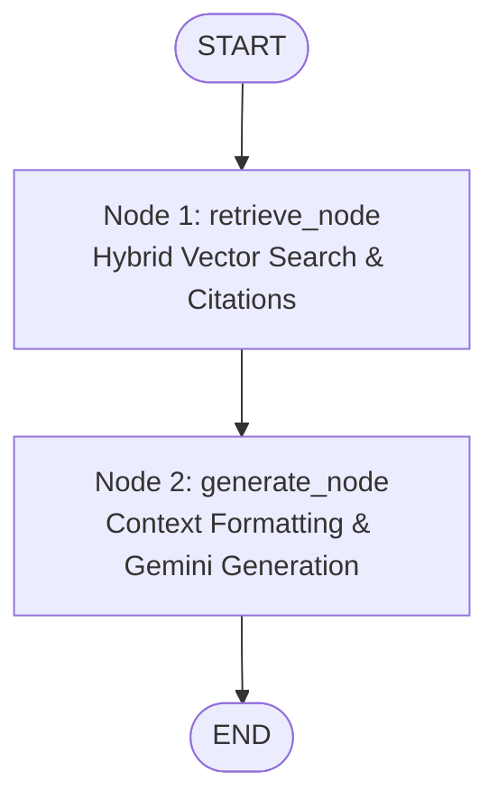

# LLM & LangGraph RAG Engine - Guidelines

## Overview

The `src/llm/` module interfaces with Google Gemini models (`gemini-3.6-flash`), manages Business Analyst persona system prompts, constructs context-augmented prompts, and orchestrates stateful RAG workflows using **LangGraph** ([`graph.py`](graph.py)) and **RAG Engine** ([`rag_engine.py`](rag_engine.py)).

---

## Code Structure & Method-by-Method Explanation of `graph.py`

### 1. Helper Function (`extract_text_content`)

```python
def extract_text_content(content: Any) -> str:
```

- **Logic**: Safely extracts plain text strings from varied LLM response content types (raw string, list of content blocks, dict with `"text"` key, or generic objects), preventing formatting errors when parsing Gemini output.

---

### 2. State Container (`RAGState`)

```python
class RAGState(TypedDict):
    question: str
    chat_history: str
    top_k: int
    similarity_threshold: float
    temperature: float
    documents: List[Dict[str, Any]]
    citations: List[Dict[str, Any]]
    generation: str
```

- **Fields**:
  - `question`: User query string.
  - `chat_history`: Conversation history text.
  - `top_k`: Number of candidate document chunks to retrieve (default: `5`).
  - `similarity_threshold`: Minimum relevance score cutoff (default: `0.3`).
  - `temperature`: Sampling temperature for Gemini generation (default: `0.2`).
  - `documents`: Raw list of matched document chunks from ChromaDB.
  - `citations`: Formatted source cards (file name, section, score, 300-char preview snippet) for UI rendering.
  - `generation`: Final text answer generated by Gemini.

---

### 3. LangGraph Workflow Builder (`build_rag_graph`)

```python
def build_rag_graph(vector_store: VectorStoreManager, model_name: Optional[str] = None):
```

#### Node 1: Retrieval Node (`retrieve_node`)
- **Logic**:
  1. Calls `vector_store.search(query=question, top_k=top_k, similarity_threshold=thresh)`.
  2. Extracts metadata (`file_name`, `source_file`, `page_or_section`, `similarity_score`).
  3. Builds `citations` metadata dictionary for UI display.
  4. Returns `{"documents": matched_chunks, "citations": citations}` to update graph state.

#### Node 2: Generation Node (`generate_node`)
- **Logic**:
  1. Checks if `documents` list is empty. If no chunks matched, returns a fallback notice to upload/sync documents.
  2. Formats retrieved chunks into context blocks:
     `[Source #N: file_name | Location: page_sec | Match Score: score]`
  3. Formats `BUSINESS_ANALYST_SYSTEM_PROMPT` prompt with `chat_history`, `context`, and `question`.
  4. Invokes `ChatGoogleGenerativeAI` (`gemini-3.6-flash`) with sampling `temperature`.
  5. Extracts generated text using `extract_text_content()` and returns `{"generation": answer}`.

#### Graph Compilation & Execution Flow
```python
workflow = StateGraph(RAGState)
workflow.add_node("retrieve", retrieve_node)
workflow.add_node("generate", generate_node)

workflow.add_edge(START, "retrieve")
workflow.add_edge("retrieve", "generate")
workflow.add_edge("generate", END)

app = workflow.compile()
```

---

## LangGraph Stateful Execution Diagram



---

## System Prompts (`prompts.py`)
- Defines `BUSINESS_ANALYST_SYSTEM_PROMPT`.
- Instructs Gemini to act as a **Senior Business Analyst**, enforcing executive bullet points, key metric summaries, table interpretation, and strict factual alignment based **only** on retrieved document context.

---

## Best Practices & Guidelines for Developers

1. **State Isolation**: Use `TypedDict` (`RAGState`) to ensure explicit typing of inputs and outputs between graph nodes.
2. **Context Block Headers**: Always format source contexts with `[Source #N: file_name | Location: page_sec | Match Score: score]` so Gemini can accurately reference source documents in its response.
3. **No-Document Fallbacks**: Return explicit feedback when vector search returns 0 documents rather than invoking the LLM on empty context.
