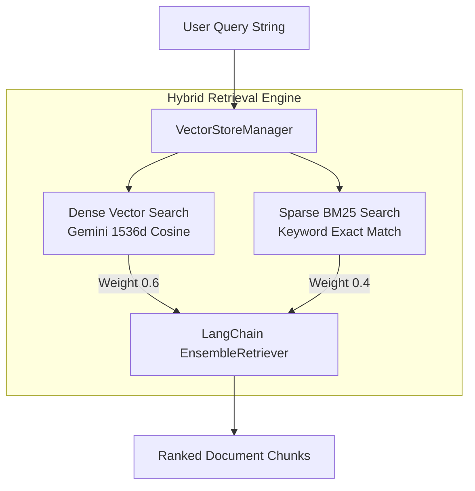

# Vector Store Module Guidelines (`store.py`)

## Folder & Module Context

The [`src/vector_store/`](file:///Users/sarthakjain/Desktop/Personal/business_analyst_rag/src/vector_store) directory contains [`store.py`](file:///Users/sarthakjain/Desktop/Personal/business_analyst_rag/src/vector_store/store.py), which handles vector storage, embedding generation, document deletion by metadata, and hybrid retrieval.

It integrates:
1. **Google Gemini Embeddings**: `GoogleGenerativeAIEmbeddings` using `gemini-embedding-001` with 1536 output dimensionality ([`settings.EMBEDDING_DIMENSION`](file:///Users/sarthakjain/Desktop/Personal/business_analyst_rag/src/config.py#L21)).
2. **ChromaDB Storage**: Persistent vector database stored in `data/vector_store/` using Cosine distance metric.
3. **Hybrid Ensemble Retrieval**: Combines dense vector similarity with sparse BM25 keyword matching via LangChain `EnsembleRetriever`.

---

## Detailed Code Explanation & Method Breakdown

### Class: [`VectorStoreManager`](file:///Users/sarthakjain/Desktop/Personal/business_analyst_rag/src/vector_store/store.py#L16-L172)

#### Constructor: [`__init__()`](file:///Users/sarthakjain/Desktop/Personal/business_analyst_rag/src/vector_store/store.py#L19-L38)
- Configures `persist_dir` from [`settings.VECTOR_STORE_DIR`](file:///Users/sarthakjain/Desktop/Personal/business_analyst_rag/src/config.py#L24).
- Formats embedding model string to `models/gemini-embedding-001`.
- Instantiates `Chroma` collection `business_analyst_documents` with `hnsw:space: cosine`.

#### Document Indexing: [`add_documents(...)`](file:///Users/sarthakjain/Desktop/Personal/business_analyst_rag/src/vector_store/store.py#L40-L51) & [`add_chunks(...)`](file:///Users/sarthakjain/Desktop/Personal/business_analyst_rag/src/vector_store/store.py#L53-L55)
- Extracts deterministic `chunk_id` metadata values to pass as primary keys to ChromaDB (`self.vectorstore.add_documents(documents, ids=ids)`), preventing duplicate vectors.

#### Document Eviction: [`delete_by_file_path(file_path_str: str) -> int`](file:///Users/sarthakjain/Desktop/Personal/business_analyst_rag/src/vector_store/store.py#L57-L69)
- Queries internal Chroma collection for vectors matching `where={"source_file": file_path_str}`.
- Deletes matching vector IDs when a file is modified or deleted from disk.

#### Semantic Vector Search: [`search(...)`](file:///Users/sarthakjain/Desktop/Personal/business_analyst_rag/src/vector_store/store.py#L71-L111)
- Performs `similarity_search_with_relevance_scores(query, k=top_k)`.
- Filters out chunks below `similarity_threshold` (default `0.3`).
- Sorts results by relevance score descending.

#### Hybrid Retrieval: [`get_retriever(...)`](file:///Users/sarthakjain/Desktop/Personal/business_analyst_rag/src/vector_store/store.py#L113-L148)
- Creates vector retriever (`Chroma.as_retriever()`).
- If `use_hybrid=True`, instantiates `BM25Retriever` over raw document texts and combines both in an `EnsembleRetriever` with weights `[0.6, 0.4]` (60% Dense Vector + 40% BM25 Sparse).

#### Collection Diagnostics: [`get_stats()`](file:///Users/sarthakjain/Desktop/Personal/business_analyst_rag/src/vector_store/store.py#L150-L157) & [`clear_all()`](file:///Users/sarthakjain/Desktop/Personal/business_analyst_rag/src/vector_store/store.py#L159-L168)
- `get_stats()`: Returns total chunk count and storage directory.
- `clear_all()`: Deletes Chroma collection and re-initializes clean vector store.

---

## Retrieval Architecture Diagram

