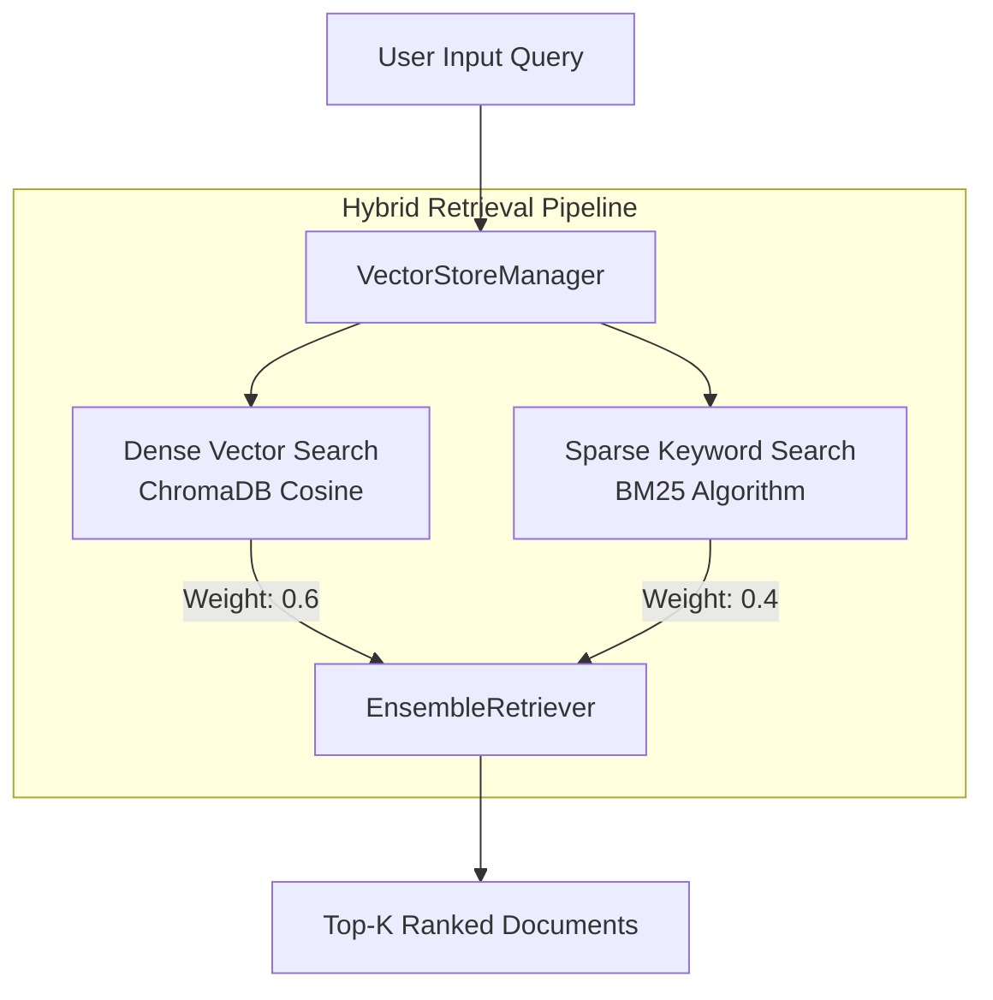

# Vector Store Module Guidelines (`store.py`)

## Overview

The [`store.py`](store.py) module provides local vector database persistence and hybrid document retrieval for the Business Analyst RAG pipeline. It encapsulates **Google Gemini Embeddings** (`gemini-embedding-001`), **ChromaDB** vector storage, and **LangChain Ensemble Hybrid Search** (combining dense vector similarity with sparse BM25 keyword matching).

---

## Code Structure & Method-by-Method Explanation

### 1. Vector Store Manager (`VectorStoreManager`)

#### Constructor (`__init__`)

```python
def __init__(self):
    self.persist_dir = str(settings.VECTOR_STORE_DIR.resolve())
    model_name = settings.GEMINI_EMBEDDING_MODEL
    if not model_name.startswith("models/"):
        model_name = f"models/{model_name}"

    self.embedding_fn = GoogleGenerativeAIEmbeddings(
        model=model_name,
        google_api_key=settings.GOOGLE_API_KEY or None,
        output_dimensionality=settings.EMBEDDING_DIMENSION,
    )
    self.vectorstore = Chroma(
        collection_name=settings.CHROMA_COLLECTION_NAME,
        embedding_function=self.embedding_fn,
        persist_directory=self.persist_dir,
        collection_metadata={"hnsw:space": "cosine"},
    )
```

- **Logic**:
  - `persist_dir`: Resolves the absolute path to `data/vector_store`.
  - `embedding_fn`: Initializes `GoogleGenerativeAIEmbeddings` using `settings.GEMINI_EMBEDDING_MODEL` with `output_dimensionality=1536` (`settings.EMBEDDING_DIMENSION`). Automatically reads `GOOGLE_API_KEY` from environment/.env.
  - `vectorstore`: Initializes LangChain `Chroma` instance with cosine distance metric (`hnsw:space: cosine`).

---

#### Document Upsertion (`add_documents` / `add_chunks`)

```python
def add_documents(self, documents: List[Document]) -> int:
    if not documents:
        return 0

    ids = [doc.metadata.get("chunk_id") for doc in documents]
    if any(i is None for i in ids):
        ids = None

    self.vectorstore.add_documents(documents=documents, ids=ids)
    return len(documents)

def add_chunks(self, chunks: List[Document]) -> int:
    return self.add_documents(chunks)
```

- **Logic**:
  - Extracts deterministic `chunk_id` values from document metadata (e.g. `a1b2c3d4_Page_1_chunk_0`).
  - Upserts vectors into ChromaDB using these IDs to prevent duplicate entries.
  - Returns count of processed chunks.

---

#### Document Eviction (`delete_by_file_path`)

```python
def delete_by_file_path(self, file_path_str: str) -> int:
    try:
        col = self.vectorstore._collection
        results = col.get(where={"source_file": file_path_str})
        ids_to_delete = results.get("ids", [])
        if ids_to_delete:
            col.delete(ids=ids_to_delete)
            return len(ids_to_delete)
    except Exception as e:
        logger.error(f"Error deleting vectors for {file_path_str}: {e}")
    return 0
```

- **Logic**:
  - Queries underlying Chroma collection for vectors matching `where={"source_file": file_path_str}`.
  - Deletes matching vector IDs when a file is modified or deleted from disk, keeping the vector database synchronized.

---

#### Direct Semantic Vector Search (`search`)

```python
def search(
    self,
    query: str,
    top_k: int = settings.TOP_K_RETRIEVAL,
    similarity_threshold: float = settings.SIMILARITY_THRESHOLD,
) -> List[Dict[str, Any]]:
```

- **Logic**:
  - Checks if database contains vectors (`count() > 0`).
  - Calls `similarity_search_with_relevance_scores(query, k=top_k)`.
  - Filters out candidates with scores below `similarity_threshold` (default `0.3`).
  - Falls back to `similarity_search` if relevance score calculation is unsupported.

---

#### Hybrid Retriever (`get_retriever`)

```python
def get_retriever(
    self,
    top_k: int = settings.TOP_K_RETRIEVAL,
    use_hybrid: bool = True,
):
```

- **Logic**:
  - Constructs `vector_retriever` (`Chroma.as_retriever()`).
  - If `use_hybrid=True`:
    1. Fetches raw document texts from collection.
    2. Instantiates a `BM25Retriever` for exact keyword/acronym matching.
    3. Combines both in an `EnsembleRetriever` with weights `[0.6, 0.4]` (`60%` Dense Vector + `40%` Sparse BM25).
  - Returns `EnsembleRetriever` (or falls back to `vector_retriever` if collection is empty).

---

#### Diagnostics (`get_stats`)

```python
def get_stats(self) -> Dict[str, Any]:
```

- **Logic**: Returns index summary containing total chunk count, collection name, and storage directory path.

---

## Retrieval Architecture Diagram



---

## Best Practices & Guidelines for Developers

1. **Deterministic Chunk IDs**: Always supply `chunk_id` in metadata during document creation so ChromaDB updates existing records instead of duplicating them.
2. **Metadata Filtering**: Store absolute file paths under `source_file` metadata to enable clean per-file deletion via `delete_by_file_path()`.
3. **Hybrid Search Weights**: Maintain `60/40` weighting between Vector Search and BM25 to balance semantic understanding and exact metric keyword matches in business documents.
